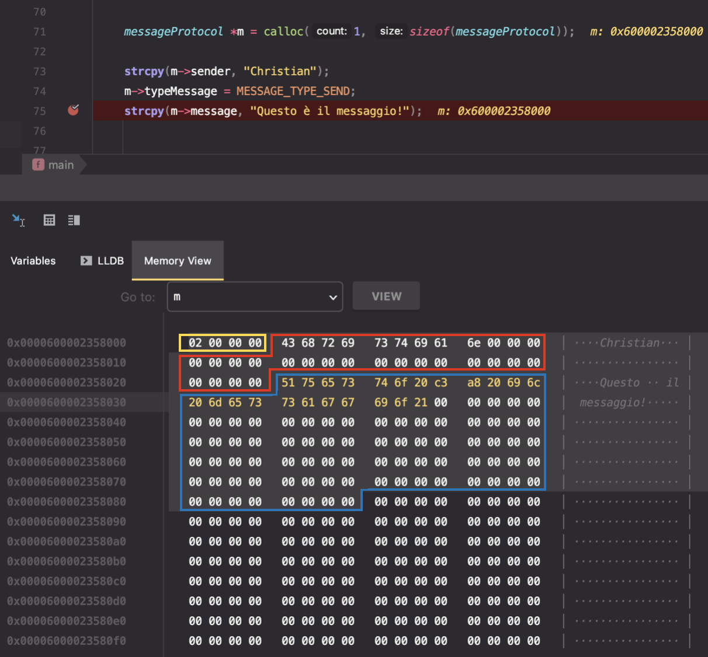
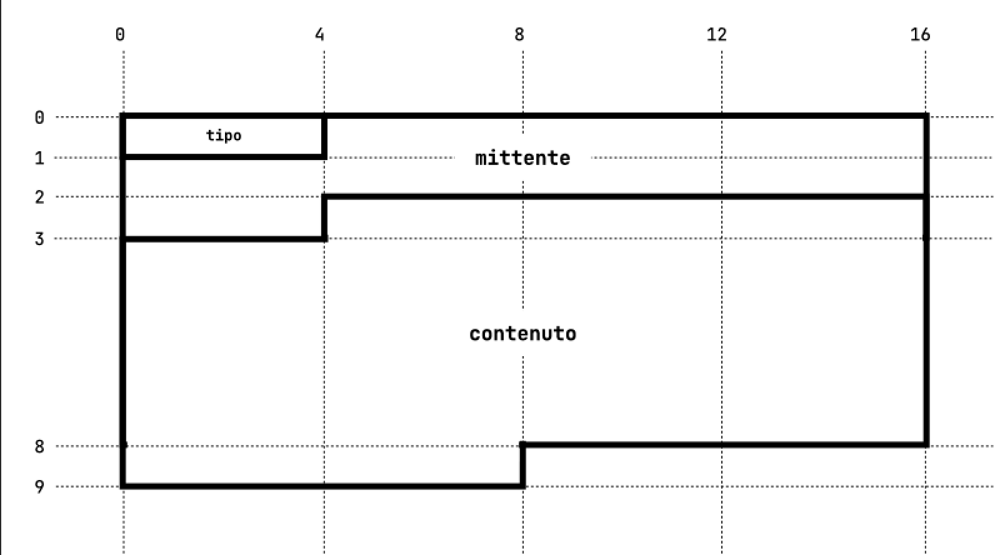

<h1>Socket Chat Room</h1>
Lo scopo è quello di realizzare una <b>chat di gruppo tra più utenti</b>.


<h2>Architettura</h2> 
<table>
  <tr>
    <td>
L'architettura è <b>centralizzata</b>, ogni client invia un messaggio al server e questo si preoccuperà di inoltrarlo a tutti gli altri client connessi.

- La parte <b>client</b> si connette a un server tramite una socket con connessione TCP. 
  Il client richiede l'inserimento di un nome utente che viene inviato al server e, successivamente, crea due thread, uno per l'invio e l'altro per la ricezione di messaggi.

- La parte <b>server</b> rimane in ascolto, in attesa che un client si connetta.
Quando avviene la connessione, il server, crea un thread che si occupa di ricevere ed inoltrare i messaggi provenienti da quello specifico client.
    </td>
    <td>
      
    </td>
  </tr>
</table>

Per fare il forwarding di un messaggio il server necessita di:
  - Gestire una <i>coda</i> che contiene indirizzo e socket descriptor di tutti i client con cui è attiva una connessione;
  - Un <i>mutex</i> per accedere alla coda in quanto questa è condivisa da tutti i thread; 
  <br>


<h2>Protocol Over TCP</h2>

<details>
<summary> <h3>Problema del Traffico elevato</h3> </summary>
Di seguito la prima versione della funzione eseguita dal thread ricevente nel client (<a href="https://github.com/coduri/SocketChatRoom/commit/dbc134fc89a03dd8d616b186aa27fd1eda45d432"><i>link</i></a>) 

```C 
void recv_handler(int* pointer_sd) {
    int sd = * pointer_sd;
    char recvbuff[MAXLEN], nomeClient[30];
    int option;

    memset(recvbuff, 0, MAXLEN);

    while(1){
        // Ricevo opzione che mi indica il tipo di messaggio (da server o da altro client)
        recv(sd, &option, sizeof(int), 0);
        int msgType = ntohl(option);

        // Messaggio inviato da un client
        if(msgType == 1){
            recv(sd, nomeClient, 30, 0);    // ricevo nome del mittente
            recv(sd, recvbuff, MAXLEN, 0);  // ricevo messaggio

            printf(COLOR_CYAN);
            printf("%s: ", nomeClient);
            printf(COLOR_RESET);
            printf("%s", recvbuff);
        }

        // Messaggio dal server: indica che c'è stato l'ingresso di un nuovo client nel gruppo
        else if(msgType == 2){
            recv(sd, nomeClient, 30, 0);  // ricevo nome del mittente

            printf(COLOR_GREEN "=== %s si è unito alla chat ===" COLOR_RESET, nomeClient); printf(" \n");
        }

        // Messaggio dal server: indica che c'è stato l'uscita di un client dal gruppo
        else if(msgType == 3){
            recv(sd, nomeClient, 30, 0);  // ricevo nome del mittente

            printf(COLOR_RED "=== %s ha abbandonato ===" COLOR_RESET, nomeClient); printf(" \n");
        }    
    }
}
```

Si può osservare che il client per stampare un messaggio deve ricevere:
  - Numero che indica la <b>tipologia del messaggio</b> (messaggio normale, join, leave);
  - <b>Nome</b> del client;
  - <b>Contenuto</b> del messaggio (nel caso di messaggio normale);

Se considero una situazione con <i>n</i> client ed un messaggio "normale" da inviare: il server dovrà inviare <i>3*(n-1)</i> pacchetti, mentre ogni client dovrà ricevere tre pacchetti.
Per risolvere questo problema di <b>traffico elevato tra le socket</b> , si è pensato di definire uno <b>pseudo-protocollo over TCP</b>.
<br><br>
</details>


<h3>Protocollo definito</h3> 
In generale, un protocollo over TCP definisce <b>come le informazioni sono scambiate</b> tra due o più parti attraverso una connessione TCP, stabilendo un formato standard per i messaggi scambiati e le azioni da intraprendere in risposta a determinati eventi.


Il formato dei messaggi che verranno scambiati tra le parti è formato dai seguenti campi:
  - <b>messageType</b>: consiste in un enum che indica il tipo di messaggio;
  - <b>sender</b>: conterrà il nome del client;
  - <b>message</b>: conterrà il contenuto del messaggio da trasferire (se il messaggio è "normale"); 

```C 
#define MAX_MESSAGE_LENGTH 100
#define MAX_SENDER_NAME_LENGTH 32
#define SIZE_OF_MESSAGE_PROTOCOL sizeof(messageProtocol)

typedef enum {
    MESSAGE_TYPE_JOIN,
    MESSAGE_TYPE_LEAVE,
    MESSAGE_TYPE_SEND,
} messageType;


typedef struct {
    messageType typeMessage;
    char sender[MAX_SENDER_NAME_LENGTH];
    char message[MAX_MESSAGE_LENGTH];
} messageProtocol;
```
<br>

<h4>Dimensione del messaggio</h4>
Una cosa da prendere in considerazione è che <b>la <i> sizeof</i> di una struttura non è sempre uguale alla somma delle <i>sizeof</i> di ogni membro</b> di essa, questo perché la dimensione della struttura intera include anche le parti di <b>padding</b> aggiunte dal compilatore per allineare i dati in memoria. 
<br><br>

Il risultato finale di queste valutazioni mi ha portato a scegliere come dimensione di un singolo messaggio 136byte, scelta che riduce al minimo lo spazio di padding inserito, permettendo 
comunque la possibilità di trasmettere un numero di caratteri adeguato ad ogni campo. 


<table>
  <thead>
    <tr>
      <th> Analisi mediante debugger </th>
      <th> Formato pacchetto </th>
    </tr>
  </thead>
  <tbody>
    <tr>
      <td>  </td>
      <td>  </td>
    </tr>
  </tbody>
</table>
